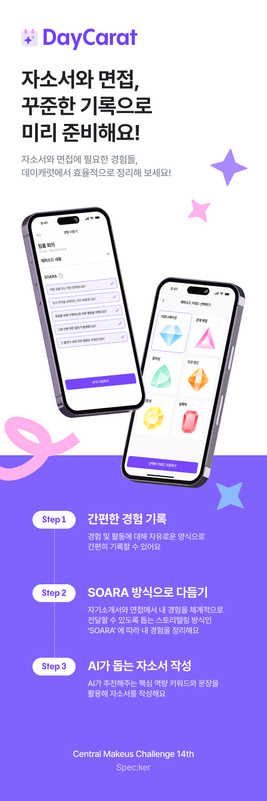

# 💎 데이캐럿 DayCarat-효율적인 취업 준비를 위한 커리어 에피소드 기록 서비스

💎 프로젝트 소개
14th makeus CMC 스패커 팀 

** 모든 커리어 경험을 한 눈에 정리하는 취준생 필수 앱 **

■ 간단히 작성하는 커리어 에피소드
대외활동, 동아리, 공모전 등등 취업으로 이어지는 다양한 경험들을 매일 간단하게 정리해요.

■ SOARA 방식을 통해 자세하게 다듬어 완성하는 커리어 에피소드
간단히 작성했던 커리어 에피소드를 'SOARA'(자기소개서 작성 및 면접에 필요한 경험을 체계적으로 정리하기 위해 활용되는 스토리텔링 기법) 방식을 통해 정리함으로써 실질적인 취업준비에 도움이 될 수 있도록 도와줘요.

■ AI가 추천해주는 취준 활용 키워드&문장
SOARA 방식을 통해 자세히 에피소드를 작성하면 AI가 취업 준비에 활용하기 좋은 키워드와 문장을 추천해줘요.

■ 작성할 때마다 쌓이는 나만의 커리어 보석들
커리어 에피소드를 작성하고, 다듬을 때마다 나만의 커리어 보석을 획득할 수 있어요. 
나만의 다채로운 보석함을 완성해보세요.

❤‍🩹Download
Play Store https://play.google.com/store/apps/details?id=com.makeus.daycarat
App Store https://apps.apple.com/kr/app/%EB%8D%B0%EC%9D%B4%EC%BA%90%EB%9F%BF/id6476876242

🩻Build with
JetPack(recyclerview,navigation,viewmodel,viewbinding)

네트워크 : retrofit2 , okHttp3

아키텍쳐 패턴 : MVVM , SAA

비동기 처리 : coroutines , kotlin flow

의존성 주입 : hilt

언어 : kotlin

디자인 : figma

thrid Party 라이브러리 : tedpermission , firebase(crashlytics , FCM) , huanghaibin-dev / CalendarView(china opensource) 

❤️‍🔥개발기간
2024.01.02 ~ 2024.02.24

🪸시연화면
시연 화면 링크
